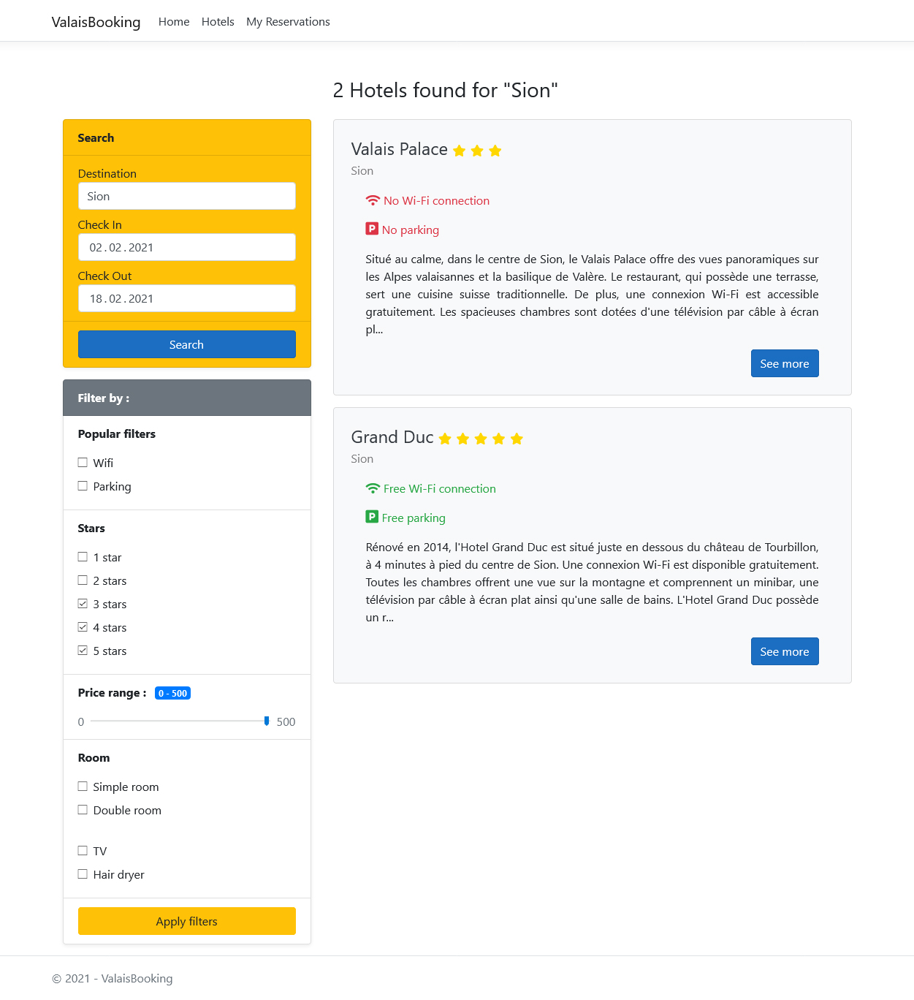
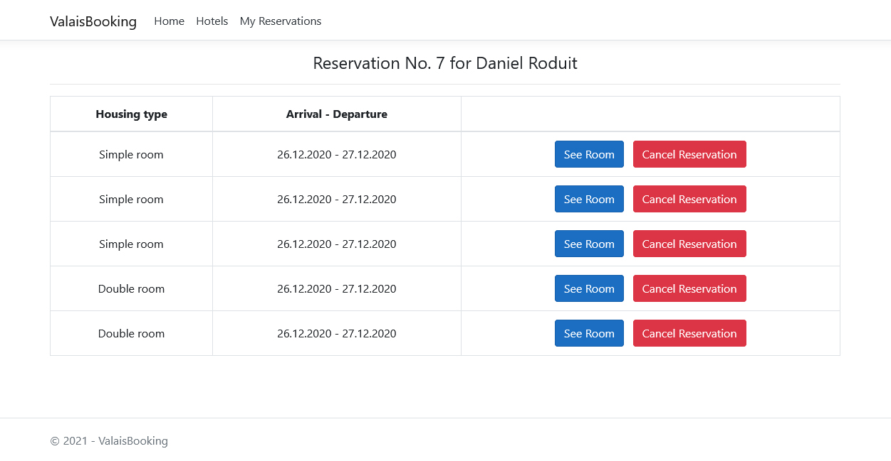

<h1 align="center">
   ValaisBooking
</h1>

    <strong>A booking site where you can find and book all the best deals in Valais 🛌 !</strong>

    <a href="https://github.com/d-roduit/ValaisBooking">
        
         
         
        
    </a>

 

The ValaisBooking project was made to get familiar with the C# language as well as to discover the ASP.NET Core framework.

This website has **not** the ambition to reach the production stage. It was created for the sole purpose of training.

## Table of Contents

1. [Getting Started](#getting-started)
2. [Technologies](#technologies)
3. [Guides and resources](#guides-and-resources)
4. [Authors](#authors)
5. [License](#license)

## Getting Started

### Running the website

1. Open the solution (`ValaisBooking.sln` file) in a code editor that supports the C# language _**(I strongly recommend Visual Studio)**_.
2. Double click on the `ValaisBooking.mdf` file located in the _ValaisBooking_ web project in order to add the ValaisBooking database to your localDB server.
3. Copy the connection string of the ValaisBooking database from your localDB and paste it in place of the old connection string in the `appsettings.json` file located in the _ValaisBooking_ web project. If you wish to also use the _ConsoleApp_ project for testing purpose, replace the old connection string in the `appsettings.json` file located in the _ConsoleApp_ project too.
4. Launch the website by clicking on the default _IIS Express_ configuration button.
5. Voilà ! 🎉 You now have the ValaisBooking webiste that is running locally.

## Technologies

The website is entirely written in C# and uses .NET 6.0.

The code has been designed following the Three-Tier Architecture.

## Guides and resources

* [ASP.NET Core](https://docs.microsoft.com/en-us/aspnet/core/) - ASP.NET Core Documentation
* [Visual Studio](https://visualstudio.microsoft.com) - The Visual Studio editor

## Authors

<table>
   <tbody>
      <tr>
         <td align="center">
            <a href="https://github.com/d-roduit">
             
            Daniel Roduit
            </a>
         </td>
         <td align="center">
            <a href="https://gitlab.com/g.cathy">
             
            Cathy Gay
            </a>
         </td>
      </tr>
   </tbody>
</table>

## License

This project is licensed under the MIT License
